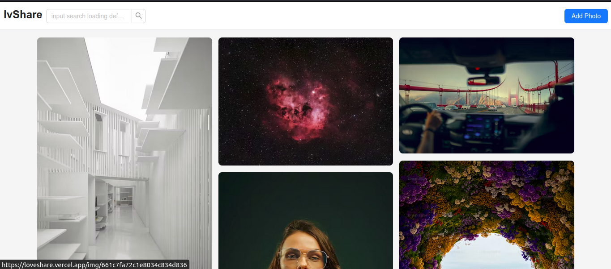
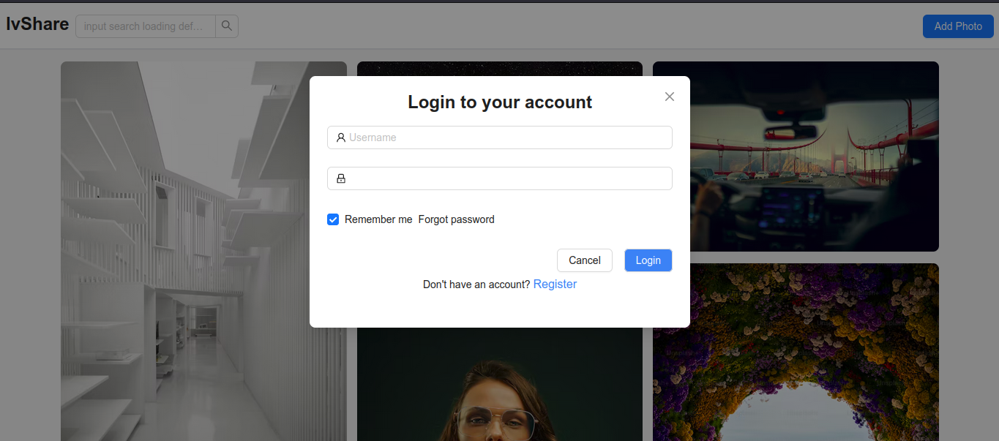
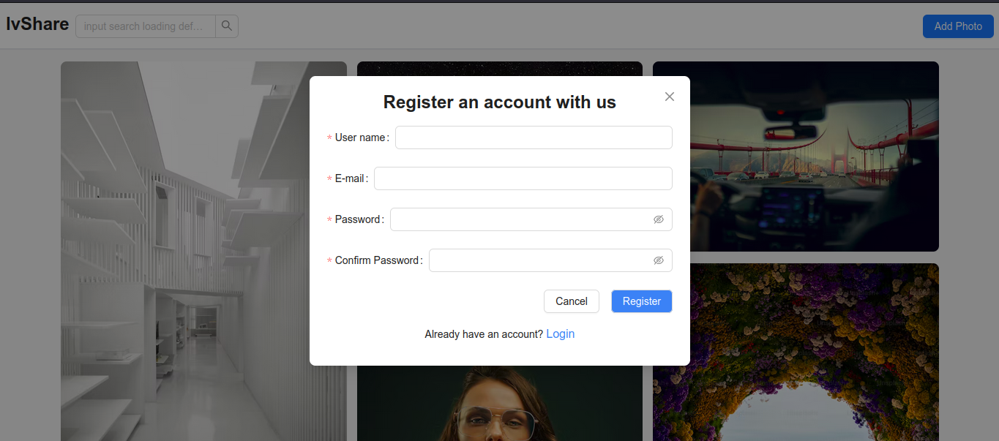
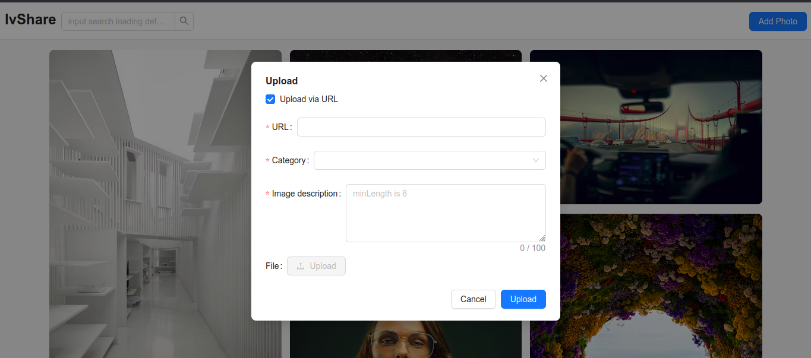
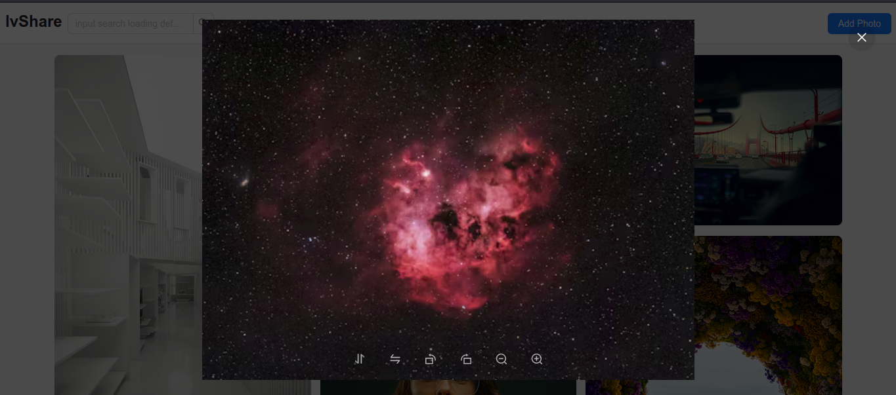
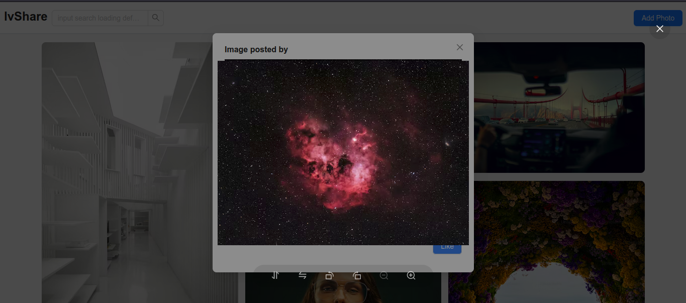

## Image Sharing Application

An image sharing application where users can register, share their memories, and interact with posts through likes and dislikes. The application includes role-based authentication, ensuring only image creators can delete or update their posts.

## Features

- User registration and authentication
- Role-based access control
  - Only creators can delete or update their posts
  - Non-creators can like or dislike images
- Image sharing and display
- Like and dislike functionality
- Secure password storage and authentication
- Responsive design

## Tech Stack

- **Frontend**: React, React Router DOM
- **Backend**: Node.js, Express.js
- **Database**: MongoDB
- **Authentication**: JSON Web Tokens (JWT)
- **Other Libraries**: CORS, bcrypt, 

## Getting Started

### Prerequisites

- Node.js
- MongoDB

